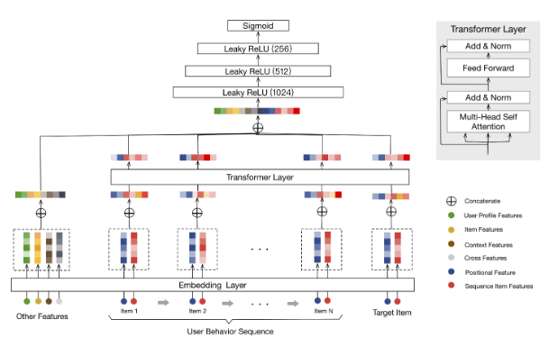

# React Interactive Movie Recommendation System Based on Behavior Sequence Transformer Model

## Brief Introduction
The Interactive Movie Recommendation System is a react application built with Typescript. It utilizes machine learning techniques to recommend movies to users based on their demographic information and movie viewing history. The system is designed to provide an interactive and personalized movie recommendation experience.

A react with Typescript application to 

## React Frontend Preview
 </img>


## Run the React Application At Local

```sh
npm install
npm run dev
```

## Full Stack Machine Learning Serverless Architecture

The Interactive Movie Recommendation System follows a full stack machine learning serverless and microservices architecture. The architecture consists of several major components that work together to provide a seamless movie recommendation experience.

 </img>


## (1) Orchestrated Training Pipeline:

**Tech Stack**: Pytorch, Prefect, Mlflow, Transformer 

**Github**: https://github.com/Nelsonlin0321/ml-behavior-sequence-transformer-for-movie-recommendation

 </img>

The training pipeline is responsible for training a behavior sequence transformer model. This model is based on the algorithm proposed by Alibaba, which can be found in the paper link to [paper](https://arxiv.org/abs/1905.06874). The pipeline uses the 1M version of the Movielens dataset to train the recommendation model. It takes into account the users' basic demographic features and sequence of movie views. Note that during the inference stage, the system assumes that the users are anonymous and without any rating history, and therefore does not use them as features. A tutorial on how to implement the behavior sequence transformer model with all features can be found in this [GitHub](https://github.com/Nelsonlin0321/ml-behavior-sequence-transformer-for-movie-recommendation) repository.
The training pipeline was orchestrated by [Prefect Cloud](https://www.prefect.io/cloud) but not deployed to cloud and it's trained by local computation.   


## (2) Model Deployment:

**Tech Stack**: Pytorch,Lambda, APIGateway, FastAPI and Terraform
**Github**: https://github.com/Nelsonlin0321/ml-bst-movielens1m-recommender-serving


The model trained in the training pipeline is deployed on AWS using FastAPI, Lambda, and APIGateway. This allows the model to be served as a serverless API. The API takes the users' demographic features and sequence of movie views as input and predicts the movies that users are most likely to like. The deployment process involves using Terraform to provision the necessary AWS resources and configuring the APIGateway to handle the API requests and we schedule to a EventBridge to regular invoke health check to avoid cold start.


## (3) Backend Movies APIs

**Tech Stack**: Dynamodb, S3, CloutFront, Lambda, APIGateway, FastAPI and Terraform
The system also includes a backend Movies API that is built using DynamoDB, FastAPI, Lambda, and APIGateway. The data from [Movielens dataset](http://files.grouplens.org/datasets/movielens/ml-1m.zip) is ingested into DynamoDB. And we crawl their cover images on Google and save them on S3.This API is responsible for serving the movie data and image urls. DynamoDB is used as the database to store the movie data, while CloudFront is used as the content delivery network to ensure fast and reliable access to the movie cover images. The APIGateway acts as the entry point for the API requests, and Lambda functions handle the request processing.


## (4) React + Typescript Movie Recommendation Application 

**Tech Stack**: React, Typescript, Vite, Chakra UI, AWS Amplify, Route 53

The frontend of the Interactive Movie Recommendation System is built using React and Typescript. The application integrates with the deployed recommendation API and the backend Movies API to provide a seamless user experience. The UI is designed using Chakra UI, which provides a set of accessible and customizable UI components. Vite is used as the build tool for fast development and HMR (Hot Module Replacement). The application is deployed using AWS Amplify, which simplifies the deployment process. Route 53 is used for DNS management and routing the application traffic pointing to the domain  [nelsonds.com](https://nelsonds.com).


